# AWS S3 Security Hardening (End-to-End)

> A real-world cloud security project implementing IAM policies, S3 bucket policies, encryption, logging, and monitoring to fully secure an S3 environment.

---

## Overview

In this project, I secured an S3 bucket for a production-like environment by enforcing:

- Least privilege access  
- Folder-level user isolation  
- IP-based access restrictions  
- Encryption enforcement  
- Activity logging and monitoring  
- Real-time alerting on destructive actions  
- Complete public access blocking  

---

## Architecture

IAM Users → IAM Policy → S3 Bucket Policy → S3 

↓

CloudTrail → CloudWatch → SNS Alerts

---

## Technologies Used

- Amazon S3  
- AWS IAM  
- AWS CloudTrail  
- Amazon CloudWatch  
- Amazon SNS  
- AWS CLI  

---

## Implementation (With Screenshots)

### 1. Create & Modify IAM Policy

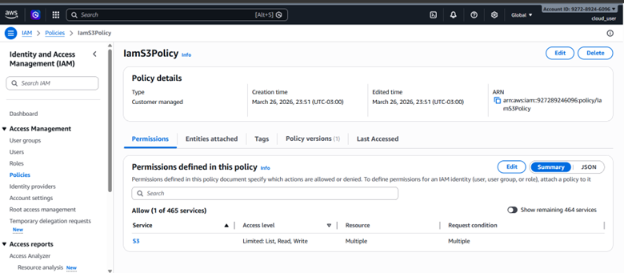

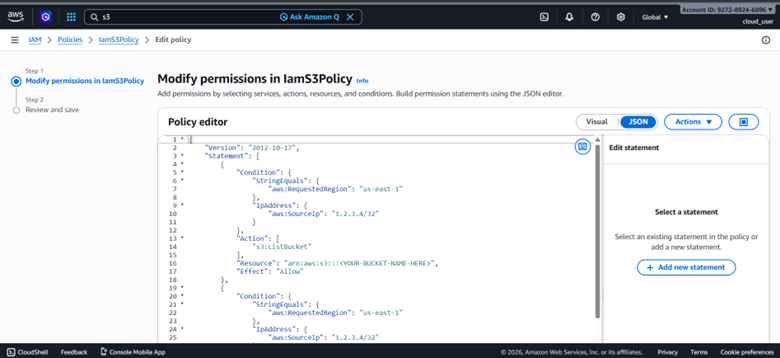

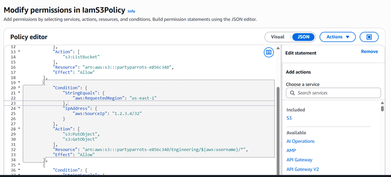

---

### 2. Confirm Policy Update

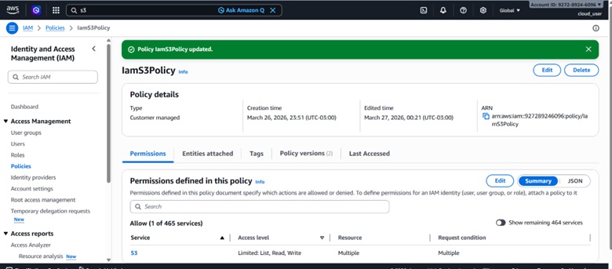

---

### 3. Configure CloudTrail Logging

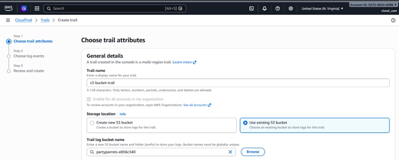

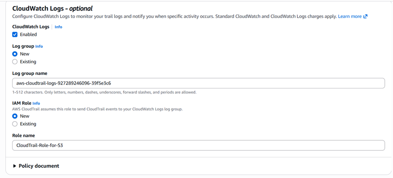

---

### 4. Configure SNS Notifications

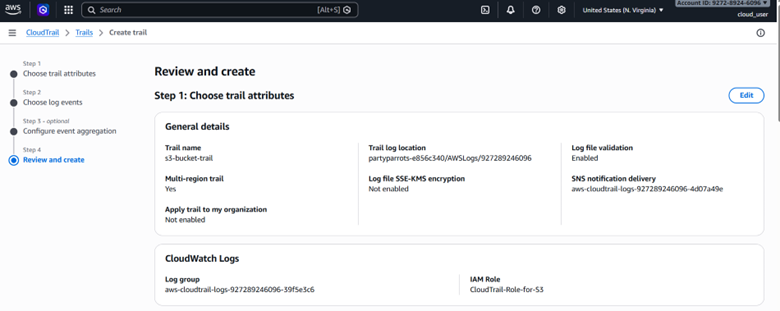

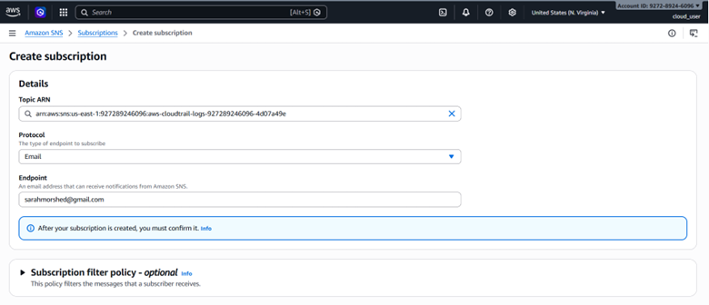

---

### 5. Create EventBridge Rule for Monitoring

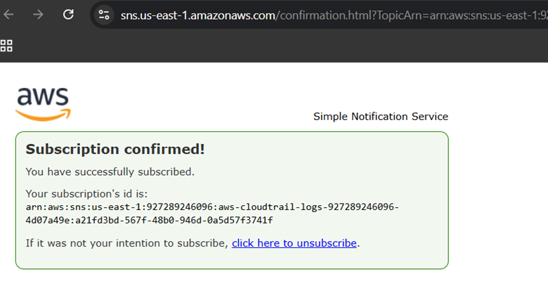

---

### 6. Attach Policy to IAM Groups

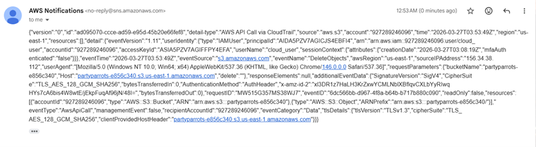

---

### 7. Verify CLI Access

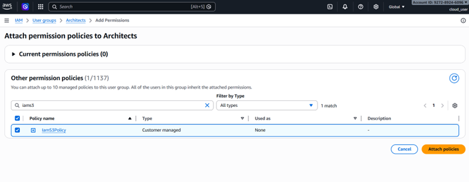

---

### 8. Create Folder-Based Access Structure

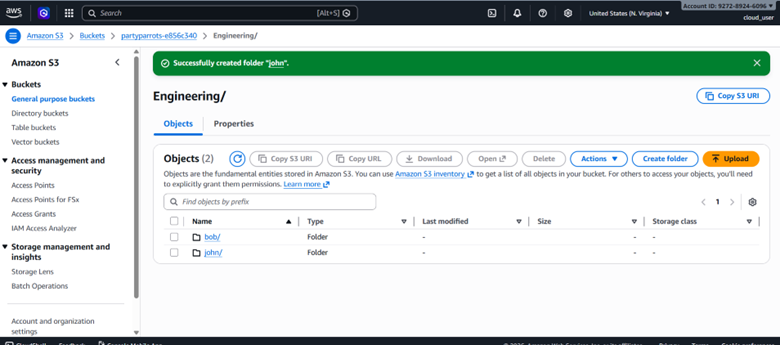

---

### 9. Test Access Restrictions

#### ❌ Unauthorized Access

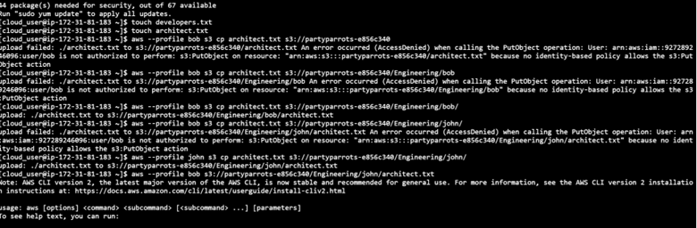

---

### 10. Test Delete Permissions

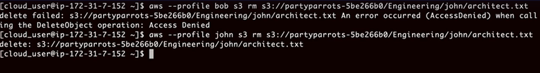

---

### 11. Enforce Encryption

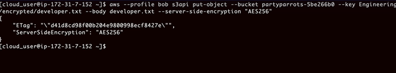

---

### 12. Block Public Access

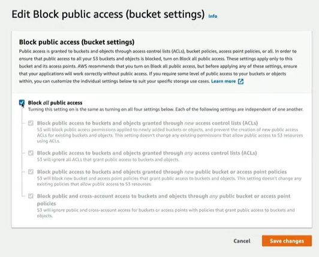

---

## Results

- Public access completely blocked  
- Users restricted to their own folders  
- Cross-user access denied  
- Encryption enforced on uploads  
- Alerts triggered on object deletion  
- Full logging enabled  

---

## Key Takeaways

- **Defense in Depth is Essential**  
  Combining IAM, bucket policies, logging, and monitoring creates strong security.

- **IAM + Bucket Policies Work Together**  
  IAM defines identity permissions, bucket policies enforce environmental controls.

- **Dynamic Access Control is Powerful**  
  `${aws:username}` enables scalable folder-level isolation.

- **Monitoring is Critical**  
  CloudTrail + CloudWatch + SNS ensures full visibility.

- **Security Must Be Enforced at Upload Time**  
  Encryption policies prevent insecure data storage.

---

## Lessons Learned

- **S3 Security Requires Multiple Layers**  
  No single service provides full protection.

- **Policy Misconfiguration is Risky**  
  Small JSON errors can break or overexpose access.

- **Testing with CLI is Crucial**  
  It reveals real-world permission behavior.

- **Delete Permissions Must Be Carefully Scoped**  
  Prevents accidental or malicious data loss.

- **Public Access Settings Are Not Enough Alone**  
  Must be combined with policies for full protection.

---

## Challenges

- Writing complex IAM JSON policies  
- Debugging permission errors  
- Understanding AWS policy evaluation logic  
- Configuring event-driven monitoring  

---

## Recommendations

- Use IAM roles instead of users  
- Enable MFA for all users  
- Integrate AWS Security Hub  
- Add automated remediation with Lambda  
- Use VPC endpoints for S3 access  

---

## Project Structure

├── README.md
├── screenshots/
│ ├── core/
│ └── full/

